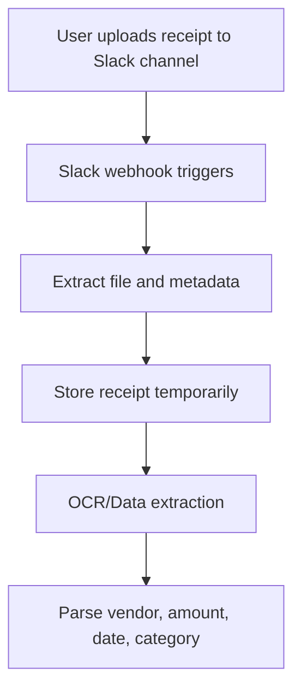
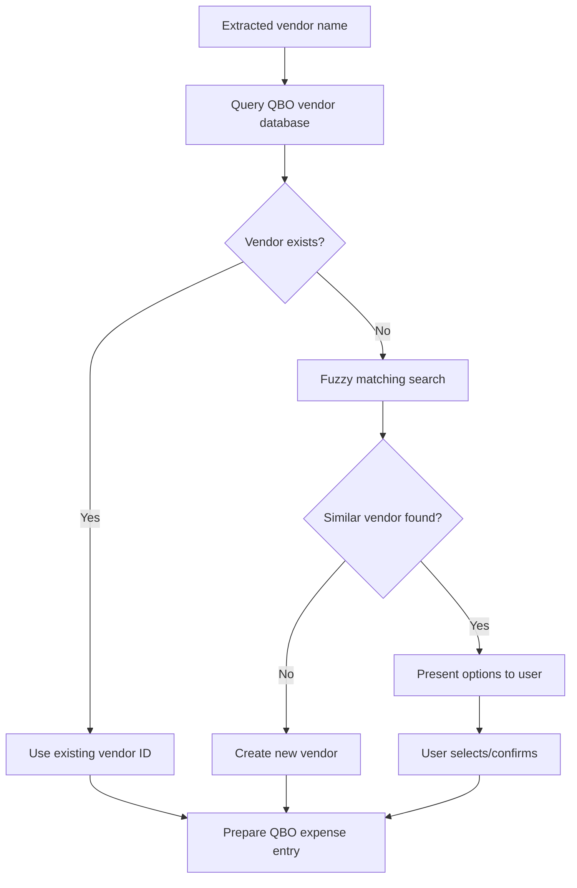
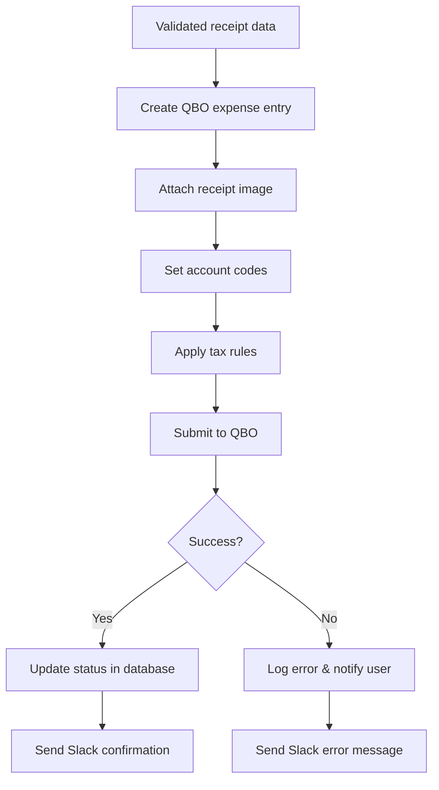

# Slack <> QBO Workflow Mapping

## 📋 Overview

This document maps out the proposed Slack to QuickBooks Online (QBO) workflow for capturing receipts and matching with historical vendors to automate expense management.

**Linear Issue:** NEX-123 - Slack <> QBO workflow  
**Status:** Planning & Design Phase  
**Project:** Nexus Ops  

## 🎯 Objective

Automate the process of:
1. Capturing receipts submitted via Slack
2. Processing receipt data and extracting key information
3. Matching vendors against historical QBO data
4. Creating expense entries in QBO automatically
5. Providing feedback and status updates in Slack

## 🏗️ Current System Analysis

### Existing Infrastructure
Based on codebase analysis, the current system includes:

- **File Upload System**: Already implemented for Linear feedback forms
  - Base64 file encoding and upload
  - Support for images (PNG, JPG, JPEG, GIF) and documents (PDF, DOC, DOCX, TXT)
  - Maximum file size: 10MB per file, 5 files per submission
  - Secure file storage via Linear's asset system

- **Slack Integration**: Basic command handling
  - `slack-demand-function.ts` handles Slack commands
  - Domain management and user statistics
  - Supabase database integration

- **Database**: Supabase backend
  - Tables: `users`, `user_logins`, `org_domains`, `orgs`, `projects`
  - Authentication and user management
  - Project tracking functionality

## 🔄 Proposed Workflow Architecture

### Phase 1: Receipt Capture via Slack



#### Components Needed:
1. **Slack Bot/App Configuration**
   - Dedicated receipt channel (e.g., #receipts)
   - File upload webhook listeners
   - Message parsing for receipt context

2. **Receipt Processing Service** (New)
   - File validation and storage
   - OCR integration (Google Vision API, AWS Textract, or Azure OCR)
   - Data extraction and parsing
   - Receipt metadata extraction

### Phase 2: Vendor Matching & Data Processing



#### Components Needed:
1. **Vendor Matching Service** (New)
   - QBO API integration for vendor lookup
   - Fuzzy matching algorithm (Levenshtein distance, phonetic matching)
   - Historical vendor pattern learning
   - Confidence scoring system

2. **QBO Integration Service** (New)
   - OAuth 2.0 authentication with QBO
   - Vendor CRUD operations
   - Expense/Bill creation
   - Chart of accounts integration

### Phase 3: QBO Entry Creation & Validation



#### Components Needed:
1. **QBO Transaction Service** (New)
   - Expense/Bill creation with proper categorization
   - Receipt attachment handling
   - Tax calculation and application
   - Account code mapping

2. **Notification Service** (Enhancement)
   - Slack message formatting
   - Status updates and confirmations
   - Error handling and user notifications

## 📊 Database Schema Extensions

### New Tables Required:

```sql
-- Receipt processing table
CREATE TABLE receipts (
    id UUID PRIMARY KEY DEFAULT gen_random_uuid(),
    user_id UUID REFERENCES users(id),
    slack_message_id TEXT,
    slack_channel_id TEXT,
    file_url TEXT NOT NULL,
    file_name TEXT NOT NULL,
    file_type TEXT NOT NULL,
    processing_status TEXT DEFAULT 'pending', -- pending, processing, completed, failed
    extracted_data JSONB, -- OCR results and parsed data
    qbo_transaction_id TEXT, -- QBO reference after creation
    created_at TIMESTAMP DEFAULT NOW(),
    processed_at TIMESTAMP,
    updated_at TIMESTAMP DEFAULT NOW()
);

-- Vendor matching history
CREATE TABLE vendor_matches (
    id UUID PRIMARY KEY DEFAULT gen_random_uuid(),
    receipt_id UUID REFERENCES receipts(id),
    extracted_vendor_name TEXT NOT NULL,
    matched_qbo_vendor_id TEXT,
    matched_vendor_name TEXT,
    confidence_score DECIMAL(3,2), -- 0.00 to 1.00
    match_type TEXT, -- exact, fuzzy, manual, new
    user_confirmed BOOLEAN DEFAULT FALSE,
    created_at TIMESTAMP DEFAULT NOW()
);

-- QBO integration settings
CREATE TABLE qbo_settings (
    id UUID PRIMARY KEY DEFAULT gen_random_uuid(),
    org_id UUID REFERENCES orgs(id),
    qbo_company_id TEXT NOT NULL,
    access_token_encrypted TEXT NOT NULL,
    refresh_token_encrypted TEXT NOT NULL,
    token_expires_at TIMESTAMP NOT NULL,
    default_expense_account TEXT,
    auto_approval_limit DECIMAL(10,2) DEFAULT 0.00,
    created_at TIMESTAMP DEFAULT NOW(),
    updated_at TIMESTAMP DEFAULT NOW()
);

-- Processing rules and patterns
CREATE TABLE processing_rules (
    id UUID PRIMARY KEY DEFAULT gen_random_uuid(),
    org_id UUID REFERENCES orgs(id),
    rule_name TEXT NOT NULL,
    rule_type TEXT NOT NULL, -- vendor_mapping, category_mapping, approval_threshold
    conditions JSONB NOT NULL, -- matching conditions
    actions JSONB NOT NULL, -- actions to take
    is_active BOOLEAN DEFAULT TRUE,
    created_by UUID REFERENCES users(id),
    created_at TIMESTAMP DEFAULT NOW(),
    updated_at TIMESTAMP DEFAULT NOW()
);
```

## 🔧 Technical Implementation Plan

### Phase 1: Foundation (Weeks 1-2)
1. **Slack App Setup**
   - Create Slack app with file upload permissions
   - Configure webhook endpoints
   - Set up receipt channel and bot commands

2. **Database Schema**
   - Implement new tables in Supabase
   - Set up proper indexes and relationships
   - Create database functions for common queries

3. **Basic Receipt Storage**
   - Extend existing file upload system
   - Add receipt-specific metadata handling
   - Implement basic OCR integration

### Phase 2: Core Processing (Weeks 3-4)
1. **OCR & Data Extraction**
   - Integrate OCR service (Google Vision API recommended)
   - Build data parsing and validation logic
   - Implement confidence scoring

2. **Vendor Matching System**
   - QBO API integration setup
   - Fuzzy matching algorithm implementation
   - Historical pattern learning system

### Phase 3: QBO Integration (Weeks 5-6)
1. **QBO Transaction Creation**
   - OAuth 2.0 authentication flow
   - Expense/Bill creation with attachments
   - Account mapping and tax handling

2. **Workflow Automation**
   - End-to-end processing pipeline
   - Error handling and retry logic
   - User approval workflows for ambiguous cases

### Phase 4: Enhancement & Optimization (Weeks 7-8)
1. **Machine Learning Improvements**
   - Vendor matching accuracy improvements
   - Category prediction based on history
   - User behavior pattern learning

2. **Advanced Features**
   - Bulk processing capabilities
   - Reporting and analytics dashboard
   - Mobile receipt capture via Slack mobile

## 🔐 Security Considerations

1. **Data Protection**
   - Encrypt QBO tokens at rest
   - Secure file storage with time-limited access
   - PII handling compliance (GDPR, CCPA)

2. **Access Control**
   - Role-based permissions for receipt processing
   - Approval workflows for high-value transactions
   - Audit logging for all financial operations

3. **Integration Security**
   - OAuth 2.0 with proper scopes for QBO
   - Webhook signature verification for Slack
   - API rate limiting and error handling

## 📈 Success Metrics

1. **Efficiency Metrics**
   - Receipt processing time (target: <2 minutes)
   - Vendor matching accuracy (target: >90%)
   - Manual intervention rate (target: <10%)

2. **User Adoption**
   - Daily active users submitting receipts
   - User satisfaction scores
   - Time saved vs. manual entry

3. **Business Impact**
   - Reduction in expense processing time
   - Improved expense tracking accuracy
   - Compliance and audit trail improvements

## 🚀 Future Enhancements

1. **AI/ML Improvements**
   - Advanced receipt categorization
   - Fraud detection capabilities
   - Predictive expense analytics

2. **Integration Expansions**
   - Additional accounting software support
   - Credit card transaction matching
   - Travel expense automation

3. **User Experience**
   - Mobile app for receipt capture
   - Voice-activated receipt submission
   - Real-time expense tracking dashboard

---

## 📝 Next Steps

1. **Immediate Actions**
   - Set up development environment for Slack and QBO APIs
   - Create test Slack workspace and QBO sandbox
   - Begin Phase 1 implementation

2. **Stakeholder Alignment**
   - Review workflow with finance team
   - Confirm QBO integration requirements
   - Establish testing and approval processes

3. **Resource Planning**
   - Allocate development resources
   - Set up monitoring and logging infrastructure
   - Plan user training and documentation

This workflow mapping provides a comprehensive foundation for implementing the Slack <> QBO receipt automation system while leveraging existing infrastructure and following best practices for financial data handling.